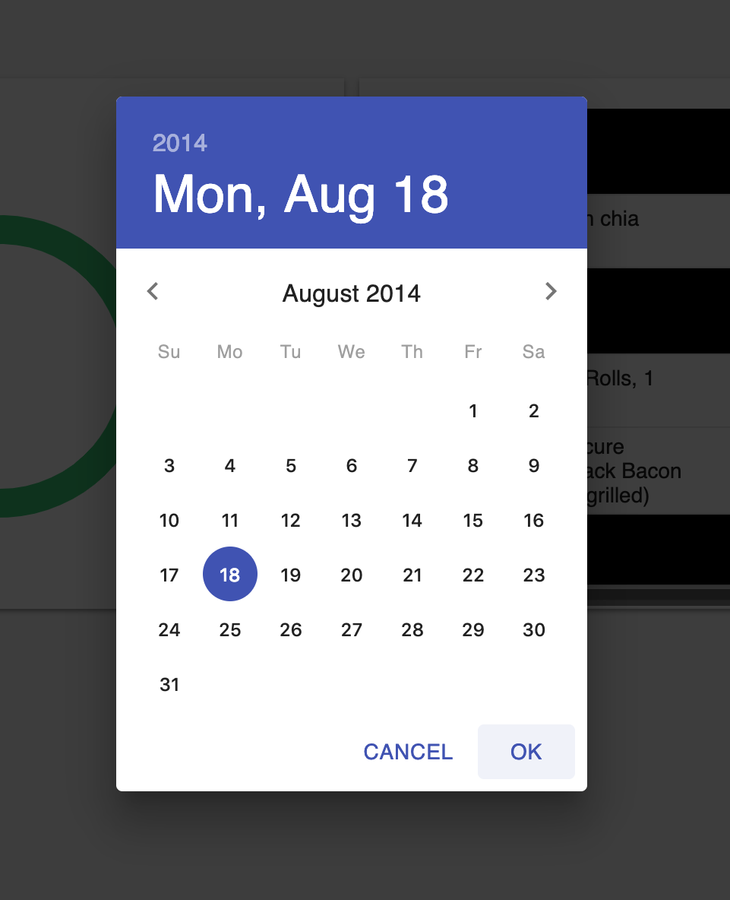

## fitdash - fitness dashboard
Integrated with mfp api. Allows users to signup, enter account details and customise their dashboard with different containers

Contains:
+ react app with material ui for front end
+ node.js backend as an authentication api. Uses mongodb to store user details and JWT's for authentication
+ django rest api for retrieving mfp details, serialising into models and storing user's data for faster lookup

docker compose can be used with `docker-compose up` to run up react, node.js, django and mongoose

